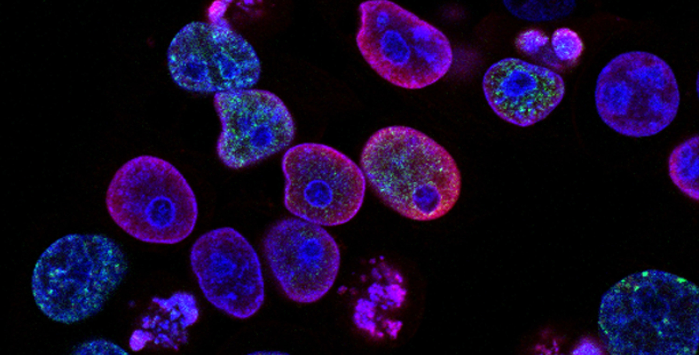
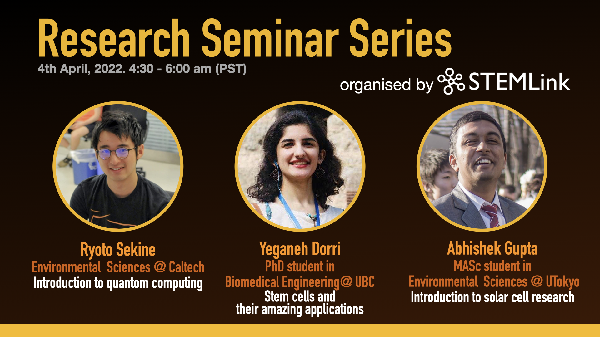

# Research Seminar Series
We are hosting research seminars to the public (we are currently focusing on high school students) to share the research we as students in STEM carry out, and what it's like to pursue an academic career in STEM.

As early career scientists, we also hope to gain the skills and experience to present our research to an audience beyond our own fields

## Biomedical Engineering Seminars

We have started with hosting bioengineering seminar series towards local high school students in Vancouver. 
Most of the presenters are graduate students from the University of British Columbia under the Biomedical Engineering Program.

## Past Events

### November 26th 2020 - 4:30-6:00pm PST

- Sean Okawa (MASc candidate in Biomedical Engineering, The University of British Columbia)    
Topic: Deep Mutational Scanning

- Rina Sakata (MASc candidate in Biomedical Engineering, The University of British Columbia)    
Topic: Introduction to Base Editors

- Yin Liu (MASc candidate in Biomedical Engineering, The University of British Columbia)    
Topic: Algae Blooms

### April 1st 2021 - 5:00-6:00pm PST

- Sofia Romero (PhD candidate in Biomedical Engineering, The University of British Columbia)     
Topic: Molecular Beekeepers

- Charlotte Barclay  (MASc candidate in Bioinformatics, The University of British Columbia)  
Topic: Tree of Life Project

## November 29th, 2021 - 4:30-6:00pm PST
 

## February 1st, 2022 - 2:30-4:00pm CRT
 

## February 26st, 2022 - 9:00-10:30am HKT
 

## April 4th, 2021 - 4:30-6:00pm PST
 

