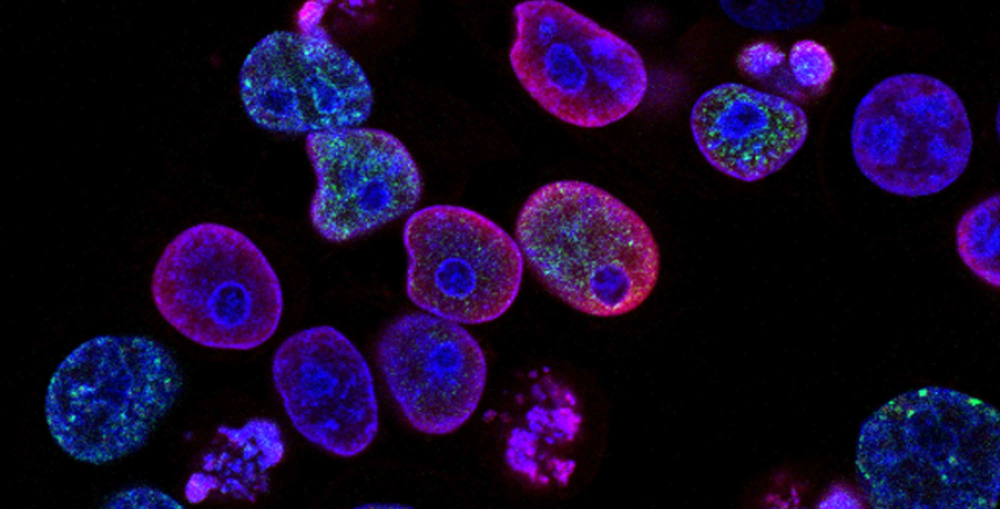

# Research Seminar Series
We are hosting research seminars to the public (we are currently focusing on high school students) to share the research we as students in STEM carry out, and what it's like to pursue an academic career in STEM.

Also, as early career scientists, we also hope to gain the skills and experience to present our research audience beyond our own research field.

## Biomedical Engineering Seminars

We have started with hosting bioengineering seminar series towards local high school students in Vancouver. 
Most of the presenters are graduate students from the University of British Columbia under the Biomedical Engineering Program.

## Past Events

### November 26th 2020 - 4:30pm - 6:00 pm

- Sean Okawa   
Topic: Deep Mutational Scanning

- Rina Sakata  
Topic: Intro to Base Editors

- Yin Liu   
Topic: Algae Blooms

### April 1st 2021 - 5:00-6:00 pm

- Sofia Romero  
Topic: Molecular Beekeepers

- Charlotte Barclay   
Topic: Tree of Life Project

## Upcoming events

