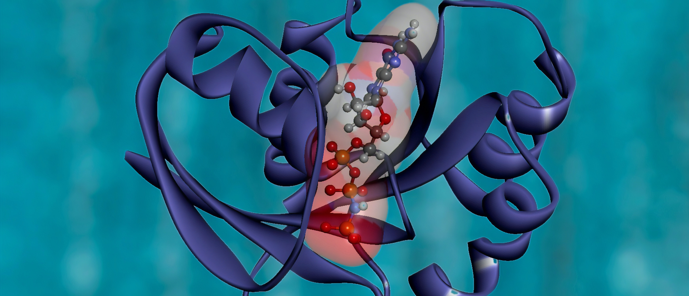

# Video Project
In addition to hosting seminars, we are also creating videos on topics that interest us and try to explain it in a way that would excite others as well!

## 3-minute scientific history series

We are making short videos on the history of rather niche scientific topics.
Explaining the history of a topic is like telling the story of the field, so we thought that it may interest others more!
When we do research on the topic, we ourselves end up encountering events and histories that we did know of either. 

### Series 1 - Protein phosphorylation 

<b> Episode 1: The discovery</b>  

https://user-images.githubusercontent.com/63035161/142738219-34fda347-9664-4187-8c5e-d24807f97098.MOV

coming soon!

<b> Episode 2: Protein phosphorylation beyond glycogenesis </b>  

<b> Episode 3: The rise of modern technologies to study phosphorylation </b>  

For further reading:    
- Cohen, P. (2002). The origins of protein phosphorylation. Nature cell biology, 4(5), E127-E130.  
- Pawson, T., & Scott, J. D. (2005). Protein phosphorylation in signaling–50 years and counting. Trends in biochemical sciences, 30(6), 286-290.

